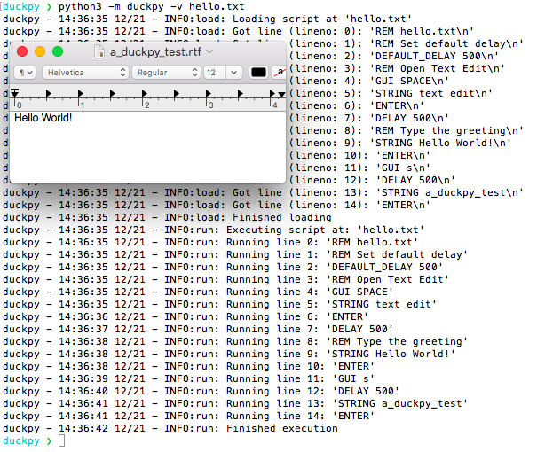

.. Include the README's description/landing

.. include:: ../README.rst
   :end-before: landing_marker_end

.. Now declare toctree

.. toctree::
   :maxdepth: 2
   :hidden:

   duckpy
   install
   usage
   contact
   license
   todo
   changelog
